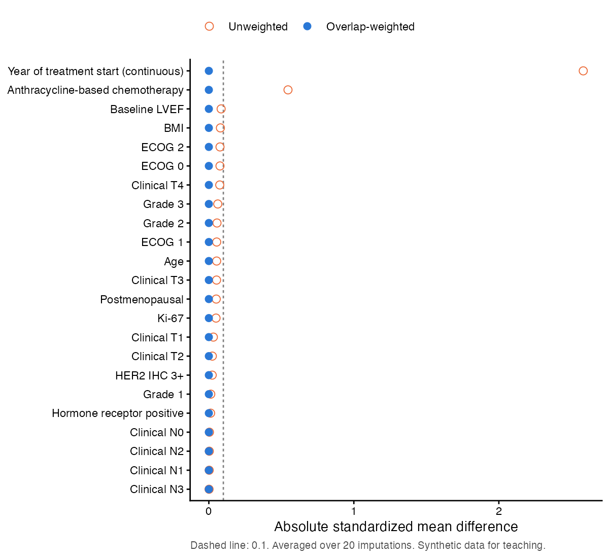
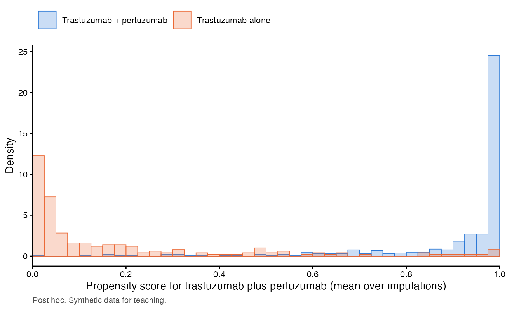

---
# JCRP 補充資料（匿名，不含作者與單位）。由 make submission 產生，請勿手改輸出檔。
format:
  docx:
    reference-doc: style/reference.docx
lang: en-US
execute:
  echo: false
  warning: false
  message: false
---

```{r setup}
knitr::opts_knit$set(root.dir = normalizePath(".."))
```

```{r load}
source("manuscript/R/render_helpers.R")
journal <- yaml::read_yaml("manuscript/journal.yaml")
supp <- supplementary_tables(journal$limits$table_max_rows)
```

**Supplementary Material**

```{r, results="asis"}
cat("**", cfg$study$title_en, "**\n\n", sep = "")
```

```{r}
demo_labels()
```



```{r, results="asis"}
for (t in supp) {
  cat("\n**", t$title, "**\n\n", sep = "")
  flextable::flextable_to_rmd(ft_df(as.data.frame(t$data)))
  cat("\n", t$footnotes, "\n\n", sep = "")
  cat("\n\n")
}
```

**Figure S1. Covariate balance before and after overlap weighting**

{width=6in}

Absolute standardized mean differences of the propensity-score covariates; dashed line, 0.1. Year of treatment start is shown as a continuous variable.



**Figure S2. Distribution of propensity scores by neoadjuvant regimen (post hoc)**

{width=6in}

Propensity scores for receiving trastuzumab plus pertuzumab, averaged over imputations. The limited overlap reflects the different treatment periods of the two regimens; overlap weighting gives the greatest weight to patients in the region of overlap.

**Supplementary File S1. Analysis code** (`JCRP_supplementary_code.zip`): the statistical analysis plan, analysis code, shared definitions with automated tests, analysis parameters, drug-name map, and records of data queries and decisions. No patient data are included. The code was written with the assistance of Claude Opus 5.5 (see the Use of Generative AI statement).
